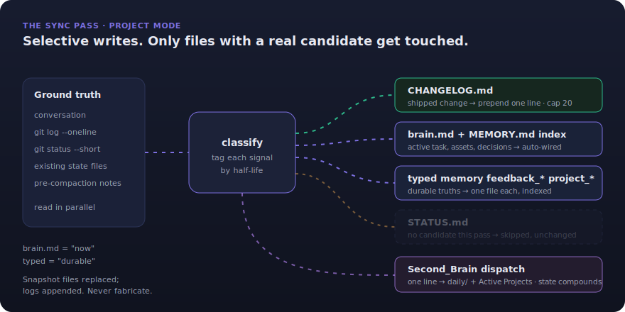

# /sync

**Architecture-aware project state-sync for Claude Code, with a context-audit pre-run.**

A single slash command that reads where it is running, classifies what actually changed in the session, and writes only the files that need touching. Before it syncs, it discovers the MCP servers, plugins, hooks, and auto-loaded memory the project pulls into the context window, estimates their token weight, and flags what is wasted for this specific project. Where prose-driven "update the docs" rituals give you noise, `/sync` gives you a deterministic, mode-aware, token-disciplined pass that compounds project state instead of bloating it.

[](https://docs.claude.com/en/docs/claude-code)
[](tests/test_context_audit.py)
[](lib/context-audit.py)
[](lib/context-audit.py)
[](sync.md)

Built for the four-vault meta-orchestrator and per-project memory layout described in [CLAUDE.md](CLAUDE.md). The command body is the source of truth; the helper is a deterministic, stdlib-only sidecar that the model calls, never the other way around.

<p align="center">
  
</p>

---

## The problem

State-refresh rituals are usually prose instructions: "update the changelog, refresh the status doc, jot down what we decided." That has three consequences.

**They write for the sake of writing.** A prose ritual has no notion of "nothing changed." It rewrites timestamps, re-summarises unchanged files, and pads logs with entries that carry no signal. Over a long-running project the state files drift from a useful snapshot into a noisy transcript.

**They are blind to where they run.** The same instructions fire inside a code repo, inside a memory vault, and at the root of a multi-vault orchestrator, and produce the wrong files in two of those three places. Run them at `$HOME` by accident and they scatter `CHANGELOG.md` and `STATUS.md` across your home directory.

**They ignore the context window they live in.** Every Claude Code session silently loads MCP server tool definitions, plugins, hooks, and auto-loaded memory. Much of it is irrelevant to the current project and quietly burns tokens on every future session. A documentation ritual never looks at that cost, let alone trims it.

This is not a "write better instructions" problem. It is a missing-machinery problem: you need mode detection, change classification, write caps, and a context audit that knows what it is allowed to touch.

**`/sync` is that machinery.**

---

## What it is

`/sync` is a Claude Code slash command: YAML frontmatter plus a Markdown body, with `allowed-tools` scoped to `Read`, `Write`, `Edit`, `Bash`, `Grep`, `Glob`. It ships with one deterministic helper, `lib/context-audit.py`, and one tuning file, `lib/context-audit.config.json`.

The contract is a single sentence: **read first, classify, skip files that do not need changes.** A sync that touches one file is a success. A sync that writes nothing is also a success. Writing for the sake of writing is failure. Silence beats narration.

Two cooperating pieces deliver that:

- **The command** (`sync.md`) holds the judgment. It detects mode, reads ground truth from git and existing state files, classifies session signals by half-life, decides which artifacts have a real candidate, writes within hard line caps, and dispatches a compressed update into the Second_Brain vault so cross-project state compounds.
- **The helper** (`context-audit.py`) holds the determinism. It discovers what the project loads, estimates token weight, and emits a verdict and an action tier per item as JSON. It takes no identity input and hardcodes nothing: every path derives from `$HOME` and the project path.

---

## The three modes

The first thing `/sync` does, every run, is work out where it is. A hard guard refuses to run at `$HOME`, the parent of `$HOME`, a filesystem root, or any directory with no project signal (no `.git`, no package manifest, and not a vault with `SOUL.md`). When the guard trips it writes nothing. This is deliberate: per-project state belongs in projects, and running the ritual at home or system root pollutes those locations permanently.

Past the guard, `/sync` classifies the directory and writes the artifacts that mode expects:

- **Project mode (default).** A normal repo or directory with a project signal. Writes the standard trio: `CHANGELOG.md` (rolling log, cap ~20 entries), `STATUS.md` (snapshot, cap ~80 lines), and `brain.md` (durable per-project memory, cap ~60 lines). Wires `brain.md` into the auto-memory `MEMORY.md` index so fresh sessions actually see it, writes typed memory files for durable truths, and dispatches one line into Second_Brain.
- **Vault mode.** Inside a Second_Brain or Second_Brain_Hermes vault (detected by `SOUL.md` + `HEARTBEAT.md` + `daily/`). Appends a timestamped block to `daily/YYYY-MM-DD.md`, updates the vault `CHANGELOG.md` only if something real shipped, and never touches the identity layer: `SOUL.md`, `USER.md`, `HEARTBEAT.md`, `HABITS.md`, and `MEMORY.md` are off-limits because reflection and the user own those.
- **Orchestrator mode.** At the `Vaults/` root that parents multiple vaults. Maintains only its own `CHANGELOG.md` / `STATUS.md` if they exist, never writes inside child vaults, and ends the report by nudging you to run `/sync` inside the specific vault instead.

---

## The sync pass

In project mode the write phase is a classifier, not a template. `/sync` reads the conversation, git log, git status, and the existing state files in parallel, then tags every candidate signal by its half-life before writing a single byte.

<p align="center">
  
</p>

The routing distinguishes two half-lives, and that distinction is the whole design:

- **`brain.md` is "now":** the active task in enough detail to resume cold, the assets currently in play, and recent decisions with their why. It is replaced often, never appended to.
- **Typed memory is "durable truth":** `feedback_*` (a validated correction, with `**Why:**` and `**How to apply:**`), `project_*` (who is doing what, by when), `reference_*` (external system pointers), and `user_*` (role, expertise, preferences). Each file is focused, indexed in `MEMORY.md`, and cheap to prune. When in doubt about durability, write a typed file: cheap to drop, expensive to re-derive.

Then it asks, per artifact: did this pass actually produce a candidate for this file? If not, the file is left untouched. Snapshot files (`STATUS.md`, `brain.md`) are replaced wholesale; only `CHANGELOG.md` and the vault `daily/` log are append-only. Nothing is fabricated: if the evidence is not in the conversation, git, or the files, it does not get written. If a dispatch into Second_Brain has nothing material to say, it says nothing.

---

## The context audit

Before the sync pass runs in project mode, `/sync` calls `context-audit.py` and reads the JSON. This is the pre-run that turns a documentation ritual into a context-hygiene ritual.

<p align="center">
  
</p>

The helper discovers everything from the filesystem (it never hardcodes a server list): global and project MCP servers from `~/.claude.json` and project `.mcp.json`, enabled plugins and hooks from the settings files, and the owned memory files under `~/.claude/projects/<slug>/memory/`. It estimates weight (a server is `tool_count × per_tool_tokens`, a memory file is `bytes ÷ 4`), labels every number an estimate, and states plainly that MCP and plugin changes take effect next session, not the current one. The reason for that honesty is a hard constraint: `/context` is a client-side TUI command whose real numbers are not exposed to slash commands, so the audit reconstructs the signal rather than reading it.

### Classification model

Each discovered item gets a verdict (`used` / `unused` / `uncertain`) and an action tier (`auto-safe` / `recommend` / `none`):

- **value-earning** servers are code-intelligence and retrieval tools that *reduce* net consumption. They are kept on code projects and flagged only where there is no code to analyze. Matched by name or by a tool-signature heuristic (`search`, `symbol`, `context`, `outline`, `reference`, `dependency`, `hierarchy`, `blast_radius`) so unknown servers of the same kind are still caught.
- **domain** servers are marked `used` only when a matching project signal is present (`dep:<pkg>`, `file:<name>`, `dir:<name>`, `gitremote:<host>`), and flagged otherwise.
- **infra (never-touch)** servers and plugins are never flagged. They are checked *first*, before the value-earning heuristic, to avoid substring collisions: `context7` contains `context`, and would be miscategorised as value-earning without the short-circuit.
- **unknown** servers stay `uncertain`. The helper takes no action; `sync.md` settles them using project context already in hand, and never auto-disables an uncertain item.

### Action follows scope

The tier is dictated by what a project is actually allowed to change. A project `.claude/settings.json` can disable only servers defined in a project-local `.mcp.json`, so those are `auto-safe`: applied on confirm by adding the name to `disabledMcpjsonServers`. A project cannot disable a globally or user-scoped server, so those are `recommend`-only: the helper prints the exact `claude mcp remove` command and edits nothing. Memory pruning is the other auto-safe action, and it folds into the sync pass rather than double-writing. The helper never writes global config (`~/.claude.json`, `~/.claude/settings.json`) or any `CLAUDE.md`.

### The jcodemunch proof

The design's load-bearing test case is one server, two verdicts. `jcodemunch` is a heavy code-intelligence server. On a code project it is **kept**, because it earns its weight by reducing the cost of reading code. On the Second_Brain vault, where there is no code to analyze, it is **flagged** for removal with the exact `claude mcp remove` command. Same server, opposite verdict, decided by project type rather than naive token weight. That is the difference between a token counter and a context audit.

---

## When to use it, and when not

**Use `/sync` when:**

- You run long-lived projects whose state files drift into noise without a disciplined refresh.
- You work across a memory architecture (per-project `brain.md`, a Second_Brain vault, a multi-vault orchestrator) and need one command that behaves correctly in each.
- You want cross-project state to compound, so a fresh session in project B can see that project A shipped something yesterday.
- Your sessions load MCP servers and plugins you suspect are dead weight on most projects, and you want a per-project read on what to trim.

**You probably do not need `/sync` when:**

- The project is a throwaway prototype with no memory layer and no downstream sessions.
- You have a single global notes file and no notion of per-project or cross-project state.
- You run no MCP servers, plugins, or hooks, in which case the context audit has nothing to discover (it degrades gracefully and reports "nothing material").

**Honest disclosure on the audit.** Every token figure the audit prints is an estimate, not a `/context` reading, and the payoff from trimming a server is next-session and compounding, not instant. The audit's value is hygiene and awareness, not a precise byte count. If the helper is missing or errors, `/sync` skips it silently and notes one line; the sync itself still runs.

---

## What `/sync` actually delivers

Three properties fall out of the machinery, not the prose:

**1. Mode-correct writes by construction.** The hard guard plus three-mode detection means the command writes the right artifacts in the right place or refuses to write at all. You cannot accidentally scatter project state across your home directory, and you cannot trample a vault's identity layer.

**2. Selective, capped, non-fabricated state.** Every artifact has a hard line cap and a replace-or-append discipline. A file is touched only when the pass produced a real candidate for it. The state files stay a useful snapshot instead of growing into an unreadable log.

**3. Context hygiene as a side effect of syncing.** Because the audit rides along with a command you already run, the discovery, estimation, and verdict happen for free on every project-mode sync, with the only auto-actions being the two that are provably safe at project scope.

---

## How this differs from `/auto-doc`

`/sync` replaces the older `/auto-doc` command and is a strict superset of it.

- **`/auto-doc`** wrote project documentation. It had no mode awareness, no hard guard against running at system root, no typed-memory schema, no Second_Brain dispatch, and no context audit.
- **`/sync`** keeps the documentation behaviour, adds architecture detection and the hard guard, adds the `brain.md` plus typed-memory split wired into auto-memory, adds cross-project dispatch, and prepends the context-audit pre-run as Step 1c.

If you have a project still carrying legacy `PROGRESS.md` or `ROADMAP.md` files, `/sync` performs a one-time migration: it folds their content into `STATUS.md`, flattens version-tagged changelog entries to one-line format, and deletes the legacy files, noting the migration in the final report.

---

## Install

The command, its helper, and the config install into `~/.claude/commands/`:

```bash
cd ~/development/sync-context-audit && ./install.sh
```

Then run `/sync` inside any project. Verify the helper standalone at any time:

```bash
python3 ~/.claude/commands/lib/context-audit.py --project "$PWD" --format text
```

`sync.md` in this repo is the source of truth; `~/.claude/commands/sync.md` is the installed copy. Edit here, then re-run `install.sh`.

---

## Layout

```
sync.md                          the command (installs to ~/.claude/commands/)
lib/context-audit.py             the audit helper (installs to ~/.claude/commands/lib/)
lib/context-audit.config.json    the tuning surface (installs beside the helper)
install.sh                       copies the above into place
tests/test_context_audit.py      pytest suite for the helper
docs/                            design + plan docs, how-it-works writeup, diagram assets
CLAUDE.md                        contributor contract for this repo
```

---

## Tuning

`lib/context-audit.config.json` is the single surface a new user edits. Nothing is hardcoded to one machine; the discovery and estimation logic needs no changes.

| Key | What it controls |
|---|---|
| `value_earning` | `names` and `tool_signatures`. A server matches if its name is listed or contains a signature substring. Kept on code projects, flagged where there is no code. |
| `domain_signals` | Map of server/plugin name to the project signals that mark it `used` (`dep:`, `file:`, `dir:`, `gitremote:`). |
| `infra_never_touch` | Servers and plugins never flagged. **Checked first**, before the value-earning heuristic, to short-circuit substring collisions such as `context7`. |
| `known_tool_counts` | Per-server tool counts for sharper estimates (read them off `/context` once). Unknown servers use `default_tool_count`. |
| `per_tool_tokens`, `memory_chars_per_token`, `min_flag_tokens`, `memory_caps_lines` | Estimation and threshold knobs. |

If you remove an entry from `infra_never_touch.names` whose name collides with a signature substring, tighten the relevant `tool_signatures` token to avoid the miscategorisation.

---

## Guardrails

- Inherits the hard guard: project mode only for the audit, never at `$HOME` or root.
- Never edits global config (`~/.claude.json`, `~/.claude/settings.json`) or any `CLAUDE.md`. The project-level and vault-level `CLAUDE.md` are sacred; if something belongs there, `/sync` surfaces it through the friction sweep, it does not write it.
- Nothing is disabled without explicit confirm. Unknown and uncertain items default to keep.
- The audit may edit only the project `.claude/settings.json`, and only the `disabledMcpjsonServers` key.
- `Second_Brain/MEMORY.md` is mostly sacred: `/sync` owns only its `## Active Projects` section; daily reflection owns the rest.
- `brain.md` must be indexed in `MEMORY.md`, or fresh sessions never load it. That wiring is the whole point of the memory layer.
- All token numbers are estimates; the effect of any trim is next-session, stated plainly.

---

## Tests

The helper is stdlib-only and covered by a 29-test pytest suite:

```bash
python3 -m pytest -q
```

The suite asserts verdicts and action tiers for seeded servers and a synthetic unknown server across code, docs-vault, and unknown project types, and checks that the byte and tool-count estimation math is deterministic.

---

## Conventions

- No em-dashes anywhere.
- No emoji, no banners. This is a developer's notebook, not marketing copy.
- The config (`lib/context-audit.config.json`) is the only thing a new user should need to edit. Paths derive from `$HOME` and the project path.
- The command body is the source of truth. The helper is deterministic and never applies actions on its own; judgment lives in `sync.md`, determinism lives in the helper.

See [CLAUDE.md](CLAUDE.md) before editing so changes stay consistent with the command's contract, and [docs/superpowers/specs/2026-05-29-sync-context-audit-design.md](docs/superpowers/specs/2026-05-29-sync-context-audit-design.md) for the full design rationale and the verified Claude Code constraints behind the action tiers.
