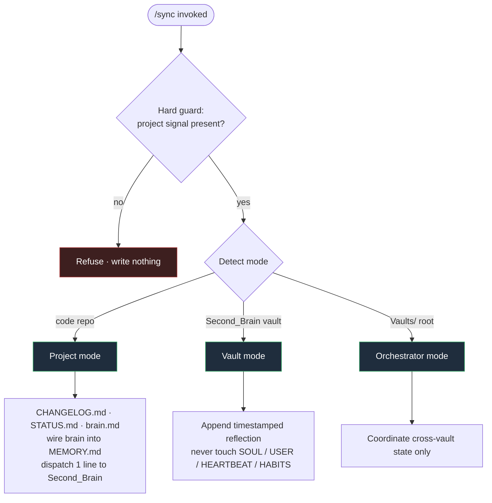
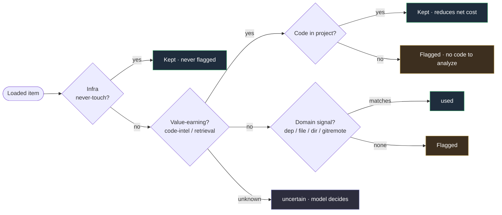

<div align="center">

# How `/sync` Works

**Architecture-aware project state-sync for Claude Code, now with a Context Audit pre-run.**

`Updated 2026-05-29`

</div>

---

## What `/sync` is for

`/sync` is the canonical state-refresh ritual. It reads the conversation, classifies what changed, and writes **only** the files that need updating. It keeps a project's memory layer current without bloating it, and dispatches a one-line update to the Second_Brain vault so cross-project state compounds over time.

It is **architecture-aware**: it detects which of three modes it is running in and writes the artifacts appropriate to that mode.

> [!IMPORTANT]
> **Hard guard: never at system root.**
> `/sync` refuses to run at `$HOME`, `/Users`, `/`, or any directory without a `.git` folder, a package manifest, or a vault `SOUL.md`. It is a project-level ritual. This stops it from scattering state files across the home directory.

---

## The three modes



| Mode | Triggers when | Writes |
|------|---------------|--------|
| **Project** _(default)_ | Inside a code repo | `CHANGELOG.md`, `STATUS.md`, `brain.md`; wires the brain entry into the auto-memory `MEMORY.md` index; dispatches one daily line to Second_Brain |
| **Vault** | Inside `Second_Brain` or `Second_Brain_Hermes` | Appends a timestamped reflection line; **never** touches the sacred `SOUL` / `USER` / `HEARTBEAT` / `HABITS` files |
| **Orchestrator** | At the `Vaults/` root | Coordinates cross-vault state only |

---

## New: the Context Audit pre-run (Step 1c)

Before syncing, `/sync` now discovers the MCP servers, plugins, hooks, and auto-loaded memory this project pulls into the context window, **estimates their token weight**, and flags what is wasted *for this specific project*. It trims the safe, project-scoped items on your confirm and recommends the rest.

> [!WARNING]
> **Two caveats stated up front.**
> - **Estimates only.** Token figures are estimates. Claude Code's `/context` numbers are not exposed to commands, so the helper approximates them.
> - **Next-session effect.** MCP and plugin changes take effect on the *next* session, not the current one.

### How classification works

Each loaded item gets a **verdict** (`used` / `unused` / `uncertain`) and an **action tier** scoped to what the helper is actually allowed to change:



| Category | Verdict rule |
|----------|--------------|
| **Value-earning** _(code-intelligence, retrieval)_ | Reduce consumption, so **kept** on code projects and **flagged** only where there is no code to analyze, such as a docs vault |
| **Domain servers** | Marked `used` only when a matching project signal is present (`dep:<pkg>`, `file:<name>`, `dir:<name>`, `gitremote:<host>`), else flagged |
| **Infra** _(never-touch)_ | Servers and plugins are **never** flagged |
| **Unknown** | Stay `uncertain`. The helper takes no action; `/sync` (the model) decides using project context already in hand |

### Action follows scope

Project `.mcp.json` servers can be **auto-disabled on confirm** via `disabledMcpjsonServers` in the project `.claude/settings.json`. Globally or user-scoped servers are **recommend-only**: a project cannot disable a global server, so the helper prints the exact `claude mcp` command instead.

> [!NOTE]
> The helper **never** writes global config or any `CLAUDE.md`.

---

## The `jcodemunch` test case

This is the design's proof. `jcodemunch` is a heavy code-intelligence server.

| Context | Verdict | Action |
|---------|---------|--------|
| A **code project** | ✅ Kept | Value-earning, it reduces net context cost |
| The **Second_Brain vault** | ⚠️ Flagged for removal | No code to analyze; prints the exact `claude mcp remove` command |

**Same server, opposite verdict**, decided by project type rather than naive token weight.

---

## The audit report block

The audit renders as the first block of the final `/sync` report:

```text
Context Audit (project type: <type>) - estimates, next-session effect
  Loaded ~<N>k est; reclaimable ~<A>k auto, ~<R>k via recommendations.
  <ranked rows: category - item - est - verdict - applied/recommended/none>
  [recommendations as one-liners with exact commands]

Sync complete. (mode: project | vault | orchestrator)
  - CHANGELOG.md: +2 entries (oldest 1 dropped)
  - brain.md: +1 asset, +1 decision
  - MEMORY.md (auto-memory): wired Brain entry
```

---

## Guardrails

> [!CAUTION]
> - **The audit never touches global config.** It may only edit the project `.claude/settings.json`, and only the `disabledMcpjsonServers` key, and only on confirm. Global MCP servers, user plugins, and `CLAUDE.md` are recommend-only.
> - **Estimates are approximate.** Never presented as exact `/context` numbers; the effect is always next-session.
> - **Fails safe.** If the helper is missing or errors, `/sync` skips silently and notes one line: `Context audit: helper unavailable.`

---

## Install

The helper, its config, and the updated `sync.md` install into `~/.claude/commands/`:

```bash
cd ~/development/sync-context-audit && ./install.sh
```

Verify the helper standalone:

```bash
python3 ~/.claude/commands/lib/context-audit.py --project "$PWD" --format text
```

The new `sync.md` is a **strict superset** of the previous one: everything it did before, plus Step 1c. The helper is stdlib-only and covered by a **29-test** pytest suite. Nothing is hardcoded to one machine; the single config file (`lib/context-audit.config.json`) is the only tuning surface a new user edits.
